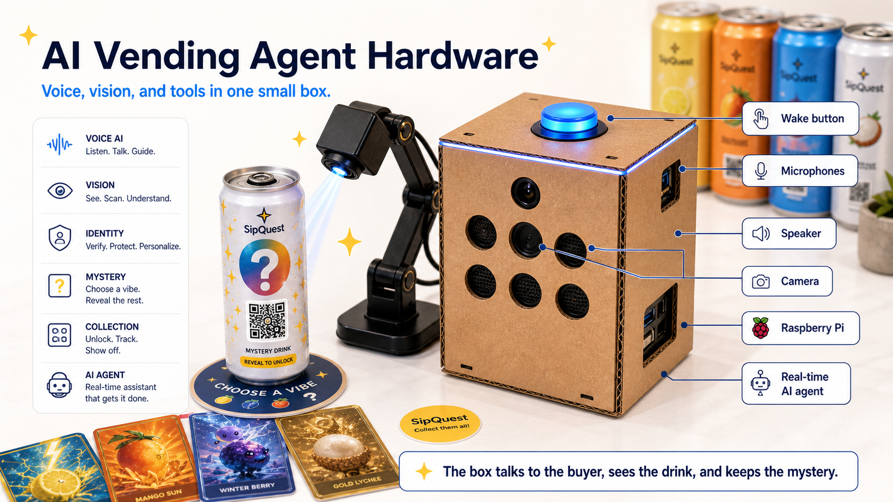
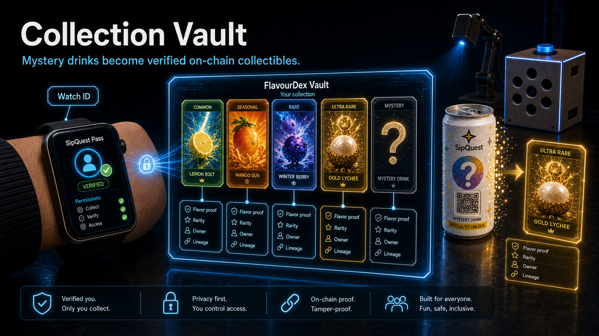
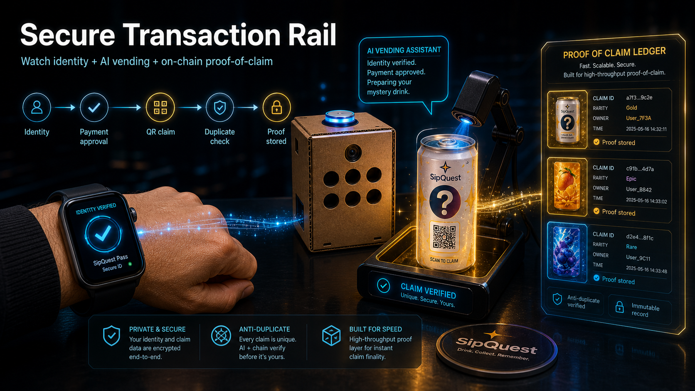

# SipQuest Box Agent

**Chat with an agent. Get a real drink from a box.**

SipQuest is an ASI:One-compatible agent that turns a natural-language drink request into a safe, camera-confirmed vending action.


## Materials

Slides:
[Google Slides](https://docs.google.com/presentation/d/1jBGSB-rBa8ClwyZB-_cRKVttiHeRcX8HqAUBQy-5tx0/edit?usp=sharing)

Video:
[YouTube](https://youtu.be/3SepxbKCnOE)







## Problem

Vending machines and unattended retail still rely on fixed buttons, QR menus, or exact SKU selection. They do not understand natural-language intent, inspect live physical stock, respect constraints such as caffeine-free, and execute fulfillment from a chat conversation.

SipQuest demonstrates the last meter of agentic commerce: the user asks in chat, the agent checks the box, chooses a safe bottle, triggers the hardware, and returns a FlavourDex reveal.

## What The Agent Does

- Understands drink intent from ASI:One / Agentverse chat.
- Reads the physical inventory model.
- Uses camera inspection with OpenCV, manual operator input, or bench fallback.
- Chooses the safe eligible bottle.
- Signals the box hardware, HTTP controller, serial controller, or bench event log.
- Confirms pickup when camera confirmation is enabled.
- Returns a FlavourDex reveal with safety and responsible-randomness wording.

## Bounty Tracks

Primary build:

- **Fetch.ai**: ASI:One / Agentverse-compatible physical box agent.
- **Learner**: complete open-source agent + hardware project.

Additional track modules:

- **CoralOS & STUK**: `coral-agents/` adds a paid `sipquest-reveal` service, seller personas, and buyer ranking criteria for the Solana devnet agent-economy rails.
- **GCC**: `agents/gcc_public_funding_agent.py` adds a transparent public-funding allocation agent with reusable impact, counterfactual, milestone, verification, and risk scoring.

## Hardware

The current box has two physical bottles:

- Blue bottle = **Blue Nova**
- Clear bottle = **Crystal Chill**

The blue bottle may have an existing physical label. In SipQuest logic it is only the blue bottle / Blue Nova. No partnership or sponsorship is implied.

The repository also includes:

- Pi box runtime under `src/sipquest_voice_box/`
- Google AIY Voice HAT hardware driver usage through `sipquest/box_controller.py`
- systemd service for the Pi under `systemd/sipquest-box.service`
- Pi installer under `scripts/install_pi.sh`
- companion watch firmware under `watch/sipquest-watch/`

## Product Rules

- This is not gambling.
- No resale value is mentioned or promised.
- No financial upside is promised.
- No paid rerolls.
- Safety constraints override mystery.
- If caffeine-free is requested, the agent never chooses Blue Nova because it is marked caffeinated.
- Allergy safety is not medically guaranteed for this two-bottle box, so allergy-constrained requests are refused.
- Rarity only affects story, art, badge, and collection progress.

## Run Locally

```bash
cd ~/projects/sipquest
python -m venv .venv
source .venv/bin/activate
pip install -r requirements.txt
cp .env.example .env
```

Start the ASI:One-compatible uAgent:

```bash
python agents/sipquest_box_agent.py
```

Run one local turn without Agentverse:

```bash
python agents/sipquest_box_agent.py --local "I want a mystery drink, caffeine-free."
python agents/sipquest_box_agent.py --local "Give me a wildcard mystery drink."
python agents/sipquest_box_agent.py --local "What drinks are in the box?"
```

Expected behavior:

- Caffeine-free request -> slot `B1`, **Crystal Chill**
- Wildcard request -> slot `A1`, **Blue Nova**

## Camera

Bench mode is the default:

```bash
CAMERA_MODE=bench
```

For webcam inspection:

```bash
CAMERA_MODE=opencv
```

Point the camera at the bottles and run the agent. If detection is inconclusive, the workflow stays safe and falls back to inventory with a warning.

For operator-assisted camera state:

```bash
CAMERA_MODE=manual
CAMERA_MANUAL_VISIBLE="blue clear"
```

## Box Control

Bench mode writes dispense events to `data/dispense_events.json`:

```bash
BENCH_BOX=true
```

For the Pi box hardware signal path:

```bash
BENCH_BOX=false
BOX_HARDWARE_BACKEND=hat
BUTTON_GPIO=23
LED_GPIO=25
BUTTON_PULL_UP=true
```

For an external controller:

```bash
BENCH_BOX=false
BOX_CONTROLLER_URL=http://localhost:8787
```

For serial:

```bash
BENCH_BOX=false
SERIAL_PORT=/dev/ttyUSB0
```

## Pi Install

Copy `.env.example` to `.env`, set `OPENAI_API_KEY`, then install to the Pi:

```bash
scripts/install_pi.sh pi@192.168.1.90
```

The installer configures the Google AIY Voice HAT overlay, installs the project into `/opt/sipquest`, and runs `sipquest-box.service`.

## Watch Firmware

The companion watch firmware lives in `watch/sipquest-watch`.

Create watch secrets locally:

```bash
cp watch/sipquest-watch/src/secrets.example.h watch/sipquest-watch/src/secrets.h
```

Build and flash with PlatformIO:

```bash
pio run -d watch/sipquest-watch -e t-watch-2020-v1
pio run -d watch/sipquest-watch -e t-watch-2020-v1 --target upload
```

`watch/sipquest-watch/src/secrets.h` is ignored by git.

## Agentverse / ASI:One

- Agent name:
- Agent address:
- Agentverse profile URL:
- ASI:One shared chat URL:

The agent uses the Fetch.ai uAgents Agent Chat Protocol and publishes the chat protocol manifest.

## Environment

```bash
AGENT_NAME=sipquest-box-agent
AGENT_SEED=
AGENT_PORT=8000
AGENT_ENDPOINT=
AGENT_MAILBOX=true

BENCH_BOX=true
BOX_HARDWARE_BACKEND=hat
BOX_CONTROLLER_URL=http://localhost:8787
CAMERA_MODE=bench
BENCH_PICKUP=true
CAMERA_CONFIRM_PICKUP=false
DATA_DIR=./data
```

Do not commit `.env`, watch secrets, agent seeds, API keys, or controller credentials.

## Tests

```bash
pytest
python agents/gcc_public_funding_agent.py --applications data/gcc/applications.json --budget-gbp 7500
```

Covered behaviors:

- parsing caffeine-free and wildcard requests
- caffeine-free -> Crystal Chill
- explicit blue + caffeine-free -> Crystal Chill fallback
- wildcard -> Blue Nova
- no safe option returns failure
- bench dispense writes an event
- reveal includes responsible randomness fields

## Limitations

- Current physical inventory has two bottles.
- Camera detection is intentionally simple and fallback-safe.
- Allergy safety is not medically guaranteed.
- Rarity has no cash value.

## License

MIT. See [LICENSE](LICENSE).
